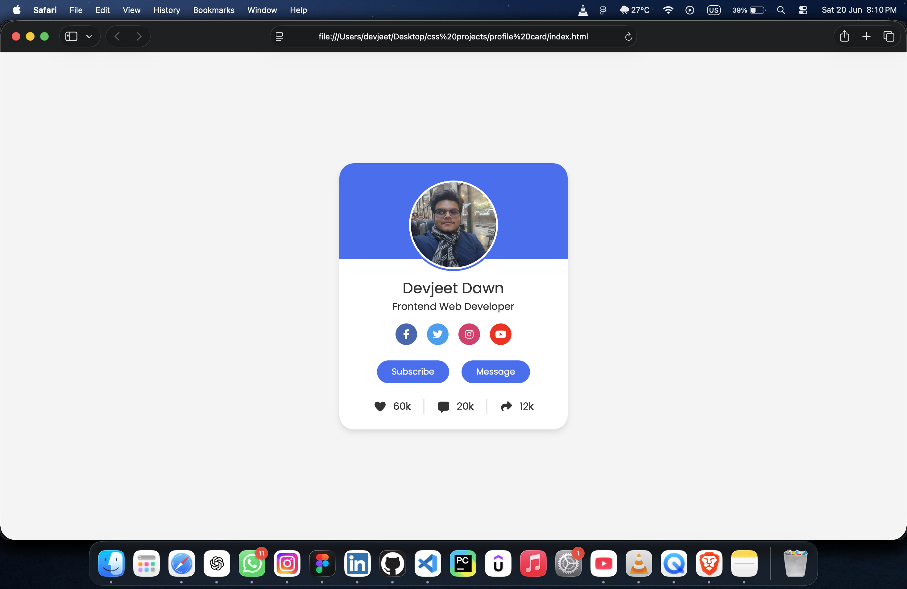

# Profile Card UI

A modern and responsive Profile Card built using HTML and CSS. The project features a clean user interface with social media links, action buttons, and user analytics.

## 📸 Screenshot

## 🚀 Live Demo

🔗 https://devjeetdawn14.github.io/profile-card/

## ✨ Features

- Modern Profile Card Design
- Circular Profile Image
- Social Media Icons
- Subscribe & Message Buttons
- User Analytics Section
- Smooth Hover Effects
- Clean and Responsive Layout

## 🛠️ Technologies Used

- HTML5
- CSS3
- Font Awesome

## 👨‍💻 Author

**Devjeet Dawn**